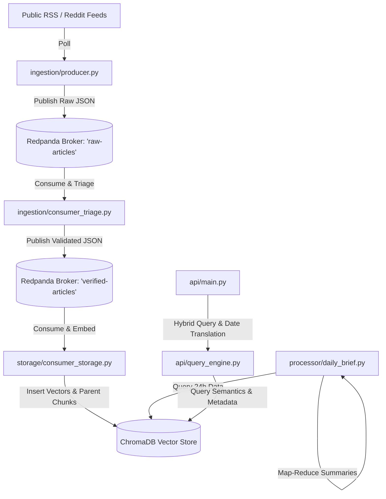

# Student Learning & Development Guide

This document defines the learning framework and rules of engagement for building the **Personalized AI News Aggregator & Analyst**. 

## Core Directive
We are not just building a product; we are building a distributed systems curriculum. Before any code is written, modified, or deployed, the AI must teach the student the concepts, architecture, and syntax of the technology being introduced.

## Rules of Engagement

1. **Explain Before You Build**: Every step must be preceded by a training block explaining:
   - What the technology is (e.g., Redpanda, ChromaDB, FastAPI).
   - Why we are using it for this specific problem (distributed messaging, vector search, async execution).
   - The key terminology and syntax.
2. **Interactive Conceptual Anchors**: Break down complex concepts into visual diagrams (e.g., Mermaid) or analogies to simplify distributed systems patterns (e.g., publish-subscribe, map-reduce, parent-child vector retrieval).
3. **No Black-Box Implementations**: Provide line-by-line or section-by-section walkthroughs of key scripts. The student must be able to point to any line of code and understand its function.
4. **Knowledge Checks**: Ask questions periodically to reinforce learning.

---

## Technical Overview of the Architecture

### The Stack Explained

| Technology | Purpose in Distributed Systems | Local Service | AWS Exam Equivalence |
| :--- | :--- | :--- | :--- |
| **Redpanda** | Event streaming and asynchronous decoupling of services | Docker Container | Amazon MSK / Amazon Kinesis |
| **ChromaDB** | Semantic vector database for storing and querying text embeddings | Docker Container | Amazon OpenSearch Serverless |
| **FastAPI** | High-performance asynchronous API server | Python Service | AWS App Runner / ECS + ALB |
| **Ollama / API Models** | LLMs used for classification (triage), summarization (Map-Reduce), and RAG | Local / Groq / Gemini | Amazon Bedrock (Haiku / Sonnet) |
