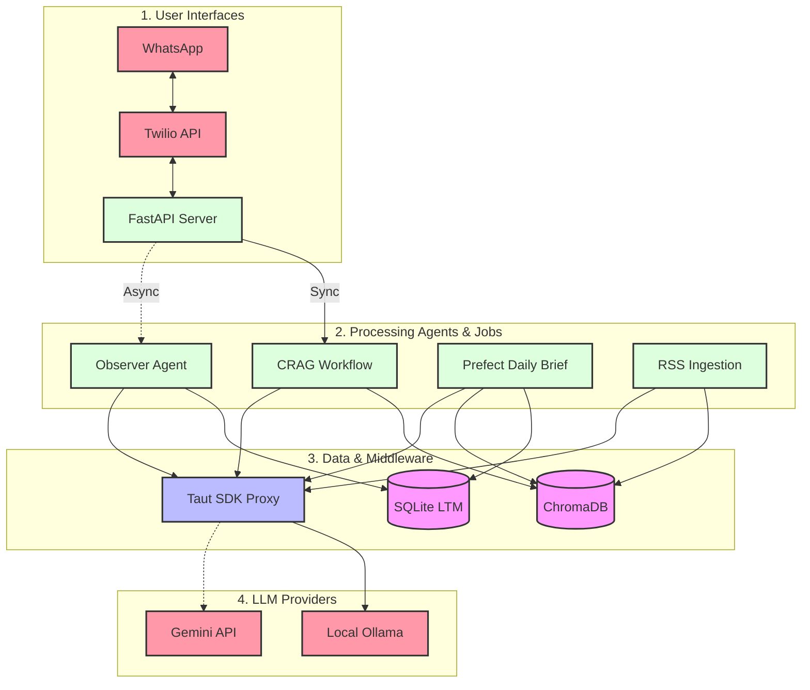

# System Architecture & Usage Guide (Local MVP)

This document provides a comprehensive breakdown of the **current local architecture**, its capabilities, and clear instructions on how to integrate and use the application today.

*(Note: The enterprise cloud migration plan can be found in `AWS_NORTH_STAR.md`)*

---

## 1. Current Architecture

The application is built for local, cost-free execution. It features asynchronous message processing, multi-agent workflows, and Map-Reduce batch processing for daily briefs. 



---

## 2. Features & Capabilities

The current application consists of four distinct operational phases that run concurrently on your local machine:

### A. High-Throughput Ingestion (The Firehose)
- **What it does:** Subscribes to global RSS feeds via Redpanda (Kafka-compatible event stream). 
- **How it works:** A producer fetches raw articles and queues them. A consumer triage script listens to the queue, invokes the local Ollama LLM via the Taut Proxy to evaluate the article's relevance and extract entities, and upserts the valid articles into ChromaDB as "parent" and "child" chunks for semantic retrieval.

### B. The Observer Agent (Long-Term Memory)
- **What it does:** Silently builds a personalized profile for each user based on their conversational history.
- **How it works:** Every time a user sends a message to the FastAPI webhook, a background task (`api/observer.py`) is fired. The Observer analyzes the message and extracts implied interests (e.g., inferring "Aerospace" from "SpaceX"), saving them to a local SQLite database.

### C. Proactive Daily Briefs (Map-Reduce)
- **What it does:** Generates highly personalized, deeply analytical daily newsletters for every registered user.
- **How it works:** A Prefect workflow (`processor/daily_brief.py`) retrieves a user's interests from SQLite, queries ChromaDB for relevant news, and executes a massive concurrent Map-Reduce job. 
- *Current Limitation:* The logic correctly queries ChromaDB for articles matching the user's interests, but the LLM Prompts themselves are currently generic. (This is pending a fix to explicitly inject the user's context into the Map-Reduce prompt).

### D. Conversational RAG (Reactive Chatbot)
- **What it does:** Answers user queries instantly via WhatsApp with highly accurate, localized context.
- **How it works:** A Twilio webhook hits the FastAPI server (`api/main.py`), triggering a stateful LangGraph CRAG workflow. The agent performs Hybrid Search on ChromaDB, grades the context, and generates a strict, concise answer routed back to WhatsApp.

---

## 3. Integration & Usage Guide

Follow these steps to completely launch and test the local pipeline from scratch.

### Step 1: Start the Core Infrastructure
Ensure you are in the project root and your Python virtual environment is activated. Start the underlying data layers:
```bash
docker compose up -d
```
*This spins up Redpanda (Event Stream) on port `9092` and ChromaDB (Vector Store) on port `8002`.*

### Step 2: Test the Ingestion Pipeline
Simulate the news ingestion firehose.
1. In terminal 1, run the producer to fetch dummy RSS articles and push them to Redpanda:
   ```bash
   python ingestion/producer.py
   ```
2. In terminal 2, run the Consumer Triage to process those events, run LLM relevance checks, and store them in ChromaDB:
   ```bash
   python storage/consumer_storage.py
   ```

### Step 3: Test the Conversational RAG & Observer Agent
Start the FastAPI server to listen for "WhatsApp" messages:
```bash
python api/main.py
```

In a new terminal window, simulate a webhook from Twilio to trigger the CRAG Agent and the background Observer Agent:
```bash
curl -X POST http://localhost:8050/webhook/twilio \
     -H "Content-Type: application/x-www-form-urlencoded" \
     -d "From=whatsapp:+1234567890&Body=I'm really starting to get interested in SpaceX and rocket launches. What's the latest news?"
```
*Expected Result:* You will get an AI-generated TwiML response regarding the news. Simultaneously, the Observer Agent will silently extract "SpaceX / Aerospace" and save it to SQLite!

### Step 4: Generate the Daily Brief
Run the Prefect orchestrator to compile the daily brief for all users based on their newly saved interests:
```bash
python processor/daily_brief.py
```
*Expected Result:* A structured JSON file named `daily_brief_+1234567890.json` will be generated in the project root, containing a Map-Reduced summary of the news matching the user's profile.

---

*This architecture relies entirely on the **Taut SDK Proxy** for advanced rate-limiting, semantic caching, and payload compression, acting as an invisible shield for the local LLM compute layer.*
